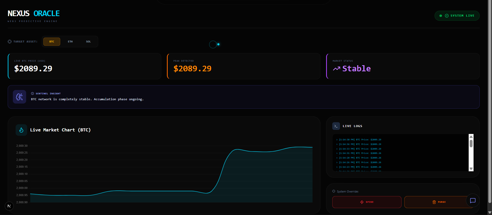
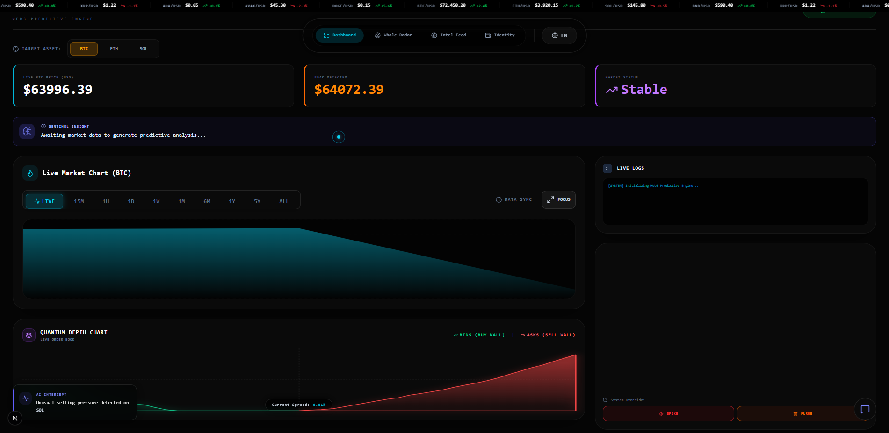

<h1 align="center">Nexus Oracle 👁️‍🗨️</h1>

  <i>Advanced Web3 Predictive Engine & Cyber-Terminal Dashboard.</i>

  
  
  
  

---

## 📌 Project Overview

**Nexus Oracle** is a high-performance Web3 market intelligence platform and cyber-terminal dashboard built to democratize access to complex, real-time decentralized data streams[cite: 2]. The ecosystem acts as a specialized data highway that intercepts live blockchain network events, monitors volatile liquidity pools, and visualizes market analytics through a centralized, high-fidelity HUD[cite: 2].

By coupling a low-latency concurrent backend with an interactive, animated user interface, Nexus Oracle bridges the gap between raw blockchain data and actionable financial intelligence[cite: 2].

---

## 💡 The Problem & The Solution

*   **The Problem:** Raw Web3 market data is highly fragmented, nested within complex mempools, and notoriously difficult for retail traders to visualize or track without deep infrastructure access.
*   **The Solution:** Nexus Oracle unifies live data streams into a single monorepo architecture, utilizing concurrent workers to process blockchain state dynamics and rendering them via high-performance reactive charts[cite: 2, 3].

---

## ⚡ System Capabilities

*   **⌨️ Command Palette (`Ctrl+K`):** Integrated omni-search navigation hub engineered for instant system overrides, routing operations, and seamless UI protocol access[cite: 3].
*   **🖥️ Root Hacker Terminal (`Ctrl+~`):** A hidden developer diagnostic console featuring a custom matrix-style rain canvas and simulated glitch hardware rendering[cite: 3].
*   **📡 Ghost Sockets:** Low-latency pipeline conducting real-time sonar interception of massive on-chain Whale transactions powered by AI anomaly detection models[cite: 3].
*   **📊 Whale Radar & Mempool Visualizer:** Deep-mempool scanning engine built to map out pending block transactions and liquidity routing behaviors before block confirmation[cite: 3].
*   **🤖 Oracle A.I. Assistant:** A context-aware market intelligence conversational chatbot integrated directly into the dashboard HUD to provide instant asset diagnostics[cite: 2, 3].
*   **🔒 The Degen Vault:** High-frequency sentimental tracking module displaying live market volatility metrics and risk indicators for altcoins[cite: 3].

---

## 📸 Command Center Interface

<table>
  <tr>
    <td align="center"><b>Main Dashboard & HUD</b></td>
    <td align="center"><b>Advanced Analytics & Terminal</b></td>
  </tr>
  <tr>
    <td align="center"></td>
    <td align="center"></td>
  </tr>
</table>

---

## 🛠️ Monorepo Architecture

This ecosystem is structured as an isolated Monorepo to unify the client-side interaction layers with the predictive backend system engines[cite: 3]:

*   **`/nexus-oracle-frontend`** — The Next.js client application featuring heavy Framer Motion web animations, Chart.js multi-dataset integrations, and highly specialized custom system state hooks[cite: 2, 3].
*   **`/nexus-core-system`** — The high-concurrency Golang API engine handling predictive math logic, real-time transaction spikes, state overriding protocols, and automatic cache-purging systems[cite: 2, 3].

---

## 🚀 Local Development Setup

### Prerequisites
* Node.js v18+ & npm
* Go 1.20+

#### Backend Installation

cd nexus-core-system
go mod download
go run main.go

### Frontend Installation

cd nexus-oracle-frontend
npm install
npm run dev

